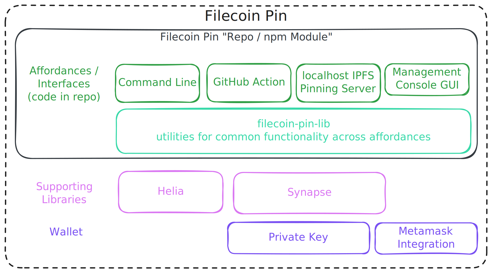

# Filecoin Pin

[](https://nodei.co/npm/filecoin-pin/)

**Store IPFS content on Filecoin's decentralized storage network with verifiable persistence.**

## Status

**⚠️ Not ready yet for production** - At least as of 2025-10-15, Filecoin Pin runs on Filecoin Calibration testnet only.  It's not ready for production use yet.

Register for updates and a later 2025 Q4 GA announcement at [filecoin.cloud](https://filecoin.cloud/).

## What is Filecoin Pin?

Filecoin Pin is a fully decentralized persistence layer for IPFS content using the global network of Filecoin storage providers with cryptographic guarantees.

When you use Filecoin Pin, your IPFS data gains:

- **Verifiable persistence** - Storage providers must cryptographically prove daily that they continue to store and serve your data
- **Economic incentives** - You only pay when storage proofs are successfully delivered and verified onchain
- **Decentralized infrastructure** - Your data can be stored across a global network of independent storage providers
- **Seamless IPFS integration** - Continue using standard [IPFS Mainnet](https://docs.ipfs.tech/concepts/glossary/#mainnet) tooling (e.g., Kubo, Helia, HTTP Gateways) while gaining Filecoin's persistence guarantees
- **Sovereign data** - Choose your providers, audit storage proofs and payments onchain, with no dependency on a single company

## Who is Filecoin Pin for?

Filecoin Pin is designed for **developers building on IPFS** who need trustless, economically-incentivized persistence for their content. Whether you're building dApps, CI/CD workflows, static websites, AI agents, or other applications, Filecoin Pin provides the missing persistence layer for IPFS.

## Affordances

Filecoin Pin offers multiple affordances to integrate Filecoin storage into your workflow:

### CLI
Upload IPFS files directly to Filecoin via the command line. Perfect for developers who want to integrate Filecoin storage into scripts, workflows, or local development environments.

- **Repository**: This repo ([filecoin-project/filecoin-pin](https://github.com/filecoin-project/filecoin-pin))
- **Documentation**: 
  - Run `filecoin-pin --help` to see all available commands and options.
  - [CLI Walkthrough](https://docs.filecoin.io/builder-cookbook/filecoin-pin/filecoin-pin-cli)
- **Installation**: `npm install -g filecoin-pin`

### GitHub Action
Automatically publish websites or build artifacts to IPFS and Filecoin as part of your CI/CD pipeline. Ideal for static websites, documentation sites, and automated deployment workflows.

- **Repository**: This repo ([see upload-action/](./upload-action))
- **Documentation**: 
   - [GitHub Action Walkthrough](https://docs.filecoin.io/builder-cookbook/filecoin-pin/github-action)
- **Example in Production**: [filecoin-pin-website CI pipeline](https://github.com/filecoin-project/filecoin-pin-website/tree/main/.github/workflows)

### JavaScript "core" Library
Opinionated JavaScript library with utilities for common functionality across different use cases. Use these modules directly in your Node.js or browser applications.

- **Repository**: This repo (see [`src/core/`](./src/core) and package exports).
- **Installation**: `npm install filecoin-pin`
- **Exports**: Core modules for CAR files, payments, Synapse SDK integration, uploads, and UnixFS operations

### IPFS Pinning Server (Daemon Mode)
Run a localhost IPFS Pinning Service API server that implements the [IPFS Pinning Service API specification](https://ipfs.github.io/pinning-services-api-spec/). This allows you to use standard IPFS tooling (like `ipfs pin remote`) while storing data on Filecoin.

- **Repository**: This repo (`filecoin-pin server` command in CLI)
- **Usage**: `PRIVATE_KEY=0x... npx filecoin-pin server`
- **Status**: Works and is tested, but hasn't received as many features as the CLI.  If it would benefit your usecase, please comment on [tracking issue](https://github.com/filecoin-project/filecoin-pin/issues/46) so we can be better informed when it comes to prioritizing.  

### Management Console GUI
Web-based management console for monitoring and managing your Filecoin Pin deployments.  This is effectively a Web UI equivalent to the [CLI](#cli).

- **Status**: Planned
- **Tracking**: See [issue #74](https://github.com/filecoin-project/filecoin-pin/issues/74) for updates.  Please leave a comment about your usecase if this would be particularly beneficial.  

## Examples in Production

See Filecoin Pin in action:

- **[upload-action](https://github.com/filecoin-project/filecoin-pin/tree/master/upload-action)** - Example GitHub Action workflows demonstrating automated IPFS/Filecoin uploads
- **[filecoin-pin-website](https://github.com/filecoin-project/filecoin-pin-website)** - Demo dApp showing browser-based file uploads to Filecoin ([Walkthrough](https://docs.filecoin.io/builder-cookbook/filecoin-pin/dapp-demo))

## Architecture

### The Big Picture

Filecoin Pin bridges IPFS and Filecoin to provide verifiable persistence for content-addressed data:


### Filecoin Pin Structure

This repository contains multiple affordances for user interaction and a shared library for consistent functionality:

<!-- Source: SVG exported from https://excalidraw.com/#room=1f613b355f33017ef481,u79JBN2E38noC8NpW8DkMQ -->


The [Synapse SDK](https://synapse.filecoin.services/) is the main library, as it's doing the work of interfacing with the rest of [Filecoin Onchain Cloud](https://filecoin.cloud) including smart contracts, Filecoin Storage Providers, and more.

[Helia](https://helia.io/) is leveraged for turning files and directories into IPFS compatible data, which we output in [CAR format](https://ipld.io/specs/transport/car/carv1/).

The affordances were [discussed more above](#affordances).  All affordances use the same core library, ensuring consistent behavior and making it easy to add new interfaces in the future.

## Quick Start

### Prerequisites

- **Node.js 24+** for CLI and library usage
- **Filecoin Calibration testnet wallet** with:
  - Test FIL for transaction gas ([Faucet](https://faucet.calibnet.chainsafe-fil.io/funds.html))
  - Test USDFC stablecoin for storage payments ([USDFC Faucet](https://forest-explorer.chainsafe.dev/faucet/calibnet_usdfc))

### Installation

```bash
npm install -g filecoin-pin
```

### Basic Usage

```bash
# 0. Set your PRIVATE_KEY environment variable or pass it via --private-key to each command.

# 1. Configure payment permissions (one-time setup)
filecoin-pin payments setup --auto

# 2. Upload a file to Filecoin
filecoin-pin add myfile.txt

# 3. Verify storage with cryptographic proofs
filecoin-pin data-set <dataset-id>
```

For detailed guides, see:
- **CLI**: [Complete CLI walkthrough](https://docs.filecoin.io/builder-cookbook/filecoin-pin/filecoin-pin-cli)
- **GitHub Action**: [CI/CD integration guide](https://docs.filecoin.io/builder-cookbook/filecoin-pin/github-action)
## Configuration

Configuration of the Filecoin Pin CLI can be performed either with arguments, or environment variables.

The Pinning Server requires the use of environment variables, as detailed below.

### Common CLI Arguments

* `-h`, `--help`: Display help information for each command
* `-v`, `--version`: Output the version number
* `--private-key`: Ethereum-style (`0x`) private key, funded with USDFC (required)
* `--rpc-url`: Filecoin RPC endpoint (default: Calibration testnet)

Other arguments are possible for individual commands, use `--help` to find out more.

### Environment Variables

```bash
# Required
PRIVATE_KEY=0x...              # Ethereum private key with USDFC tokens

# Optional
RPC_URL=wss://...              # Filecoin RPC endpoint (default: Calibration testnet)

# Optional for Pinning Server Daemon
PORT=3456                      # Daemon server port
HOST=localhost                 # Daemon server host
DATABASE_PATH=./pins.db        # SQLite database location
CAR_STORAGE_PATH=./cars        # CAR file storage directory
LOG_LEVEL=info                 # Logging verbosity (info, debug, error)
```

### Default Data Directories

When `DATABASE_PATH` and `CAR_STORAGE_PATH` are not specified, data is stored in platform-specific locations:
- **Linux**: `~/.local/share/filecoin-pin/`
- **macOS**: `~/Library/Application Support/filecoin-pin/`
- **Windows**: `%APPDATA%/filecoin-pin/`

## Development

Want to contribute to Filecoin Pin or run it locally?

```bash
# Clone and install
git clone https://github.com/filecoin-project/filecoin-pin
cd filecoin-pin
npm install

# Run the Pinning Server
npm run dev

# Run tests
npm test

# Compile TypeScript source
npm run build

# Run the cli
# This is the equivalent of running `filecoin-pin` if you had it installed globally (e.g., `npm install filecoin-pin -g`).
# It's like doing `npx filecoin-pin` that isn't stuck on that version until you `run npm install filecoin-pin -g` again.
node ./dist/cli.js
```

### Testing

```bash
npm run test             # All tests
npm run test:unit        # Unit tests only
npm run test:integration # Integration tests
npm run lint:fix         # Fix formatting
```

## Community and Support

### Contributing

Interested in contributing? Please read our [Contributing Guidelines](CONTRIBUTING.md) for information on commit conventions, PR workflows, etc.

### Get Help

- **Issues**: Found a bug or have a feature request? [Open an issue](https://github.com/filecoin-project/filecoin-pin/issues) in this repository
- **Community Discussion**: Join the conversation in Filecoin Slack's public [#fil-foc](https://filecoinproject.slack.com/archives/C07CGTXHHT4) channel

### Documentation

- **[documentation/](documentation/)** - (Coming Soon) Additional documentation about how filecoin-pin works, design decisions, etc.
- **[docs.filecoin.io](https://docs.filecoin.io/builder-cookbook/filecoin-pin)** - Filecoin Pin guides and tutorials


## License

Dual-licensed under [MIT](LICENSE-MIT) + [Apache 2.0](LICENSE-APACHE)
